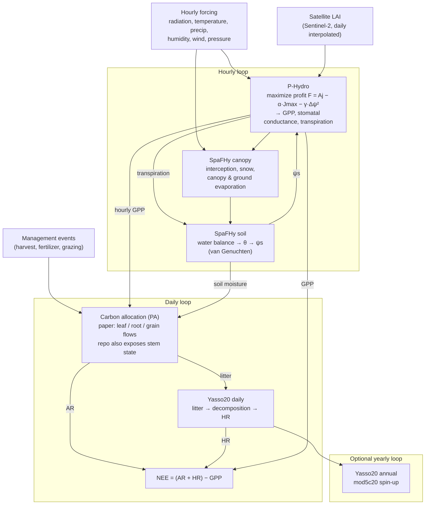

# diffSVMC

Differentiable port of the [SVMC](https://github.com/huitang-earth/SVMC) vegetation process model to [JAX](https://github.com/jax-ml/jax) (Python) and [`@hamk-uas/jax-js-nonconsuming`](https://hamk-uas.github.io/jax-js-nonconsuming) (TypeScript/browser).

The goal is a numerically faithful, fully differentiable reimplementation suitable for gradient-based parameter calibration and interactive browser-based exploration.

🤖 AI generated code & documentation with gentle human supervision.

## What is SVMC?

SVMC (Soil-Vegetation Model Coupled) is a process-based
soil-plant-atmosphere model developed at the Finnish Meteorological
Institute (FMI) and Natural Resources Institute Finland (Luke). In the
[reference paper](https://doi.org/10.5194/egusphere-2025-5972) (Tang et
al. 2025) the model is called SPY-C
(SpaFHy-Phydro-Yasso for Carbon calculation). It simulates how crops
grow, use water, and exchange carbon with the atmosphere over time.
The model was developed to study how the water-transport properties of
plants ("hydraulic traits") affect crop productivity and drought
resistance, using continuous CO₂ and water flux measurements from
Finnish crop fields (perennial forage grass at Qvidja, oat at Hauho).

The model couples four interlinked modules:

- **P-Hydro** (Joshi et al. 2022) — the photosynthesis and water
  transport module. Every hour, the model assumes that the plant adjusts
  two things to maximize net benefit: how much photosynthetic capacity to
  maintain ($J_\text{max}$, the maximum rate of electron transport in the
  leaf) and how hard to pull water from the soil ($\Delta\psi$, the
  soil-to-leaf water potential difference). The trade-off is captured by
  a profit function
  $F = A_j - \alpha\, J_\text{max} - \gamma\, \Delta\psi^2$: the plant
  gains carbon through light-limited photosynthesis ($A_j$) but pays a
  cost to maintain photosynthetic machinery ($\alpha$) and to keep its
  water-transport pathway intact ($\gamma$; pulling harder risks
  cavitation — air bubbles in the xylem that block water flow). Solving
  this optimization determines stomatal conductance (how open the leaf
  pores are), carbon assimilation (GPP), and transpiration (water loss).
- **SpaFHy** (Launiainen et al. 2019) — the water balance module.
  Tracks rainfall interception by the canopy, snow accumulation and melt,
  and a single-layer soil water store. It converts the soil's volumetric
  water content to a water potential $\psi_s$ using the van Genuchten
  retention curve (an empirical relationship between how wet the soil is
  and how tightly it holds water) and passes $\psi_s$ to P-Hydro. In
  return, P-Hydro supplies the transpiration flux that depletes the soil
  water store, creating a tight hourly feedback loop between water supply
  and plant demand.
- **Carbon allocation** — the phenology and allocation module (PA).
  Each day, the carbon fixed by photosynthesis (GPP) is allocated to
  leaf and root pools, with an additional grain-filling term for cereal
  crops as described in the paper. In this repo's implementation, the
  allocation wrapper also exposes a stem carbon pool used in the model's
  aboveground biomass bookkeeping. The plant pools lose carbon through
  autotrophic respiration (the plant's own maintenance and growth costs)
  and turnover, producing litter that falls to the soil.
- **YASSO20** (Viskari et al. 2022) — the soil carbon decomposition
  module. Receives daily litter from the allocation module and
  maps it into four chemical input fractions: Acid-soluble,
  Water-soluble, Ethanol-soluble, and Non-soluble (collectively
  "AWEN"). A fifth, slow Humus pool is part of the YASSO20 state, but it
  does not receive external litter input directly; it gains carbon via
  transfers within the decomposition system. Microbial breakdown of
  these pools releases CO₂ as heterotrophic respiration (HR). YASSO20
  uses a matrix-exponential solver to update pool sizes, running at daily
  and optional annual time scales.

The model is driven by hourly meteorological forcing (radiation,
temperature, precipitation, humidity, wind, pressure), satellite-derived
LAI (leaf area index — total leaf surface per unit ground area), and
management events (harvest, fertilization, grazing). Key outputs
include:

- **GPP** — gross primary productivity (total carbon fixed by
  photosynthesis)
- **NEE** — net ecosystem exchange (ecosystem respiration minus GPP;
  positive = net CO₂ source)
- **ET** — evapotranspiration (total water leaving the soil-plant system)
- **Soil moisture** and soil water potential
- **Carbon pool trajectories** — daily time series of leaf, stem,
  root, grain, and soil organic carbon stocks

## Repository structure

```
packages/
  svmc-ref/    Fortran reference harness, fixture generation, branch audit,
               and the fpm-staged source mirror used for reference builds
  svmc-jax/    JAX reimplementation (float64, autodiff, invariant tests)
  svmc-js/     TypeScript reimplementation (float32/float64, browser-ready)
  svmc-webr/   R/WebR wrapper for running Fortran allocation in the browser
website/       Interactive demo (Vite, served on GitHub Pages)
vendor/
  SVMC/        Original Fortran model (git submodule)
scripts/       CI tooling (branch coverage audit, Fortran vs JAX comparison)
issues/        Upstream bug reports for SVMC
```

## Model overview

The model couples four modules across hourly, daily, and optional yearly
update loops. P-Hydro and SpaFHy are tightly coupled at the hourly scale:
SpaFHy converts soil moisture to soil water potential and passes it to
P-Hydro, which returns transpiration back to the water balance.



For the leaf-level call graph and porting order, see [DEPENDENCY-TREE.md](DEPENDENCY-TREE.md).

## Porting approach

Each submodel is ported bottom-up (leaf functions — the lowest-level routines with no internal sub-calls — first), following the phased plan in [PLAN.md](PLAN.md):

1. **Fortran reference logging** — the test harness (a driver program that calls each original Fortran routine over a grid of inputs) captures inputs and outputs as JSONL (newline-delimited JSON) fixtures (saved reference data used as ground-truth test cases).
2. **Branch audit** — every conditional branch in the Fortran source is annotated with a `PORT-BRANCH` tag, registered in a coverage manifest, and evaluated for whether the fixtures exercise it.
3. **JAX port** — differentiable reimplementation using `jnp.where` for branch-free autodiff (automatic differentiation). Tested with fixture playback, metamorphic invariants (tests that check mathematical properties like monotonicity or conservation rather than exact values), and gradient/out-of-distribution validation.
4. **TypeScript port** — `@hamk-uas/jax-js-nonconsuming` reimplementation tested against the same fixtures, with `checkLeaks` (runtime verification that every GPU array is properly disposed) memory safety and epsilon-derived (computed from the floating-point precision limit) tolerance bounds.

See [CONTRIBUTING.md](CONTRIBUTING.md) for the `PORT-BRANCH` convention.

## Current deviations from upstream SVMC

### Zero-radiation P-Hydro guard (harness + JAX)

Upstream SVMC calls P-Hydro on every hour regardless of radiation.  The harness adds `int_rg > 0.0d0` (and the JAX integration mirrors it as `rg > 0.0`) to skip the optimizer when there is no light.  Without this guard the quadratic solver's analytically-zero `aj` picks up ±1e-17 floating-point noise whose sign is compilation-context-dependent, corrupting the `num_gpp` averaging denominator nondeterministically.  Integration fixtures are regenerated with this guard, so fixture values differ from a raw upstream run on zero-PPFD hours.

### P-Hydro optimizer: selectable projected solvers (JAX)

Upstream Fortran uses L-BFGS-B (a standard algorithm for optimization with box constraints; Morales and Nocedal 2011) with finite-difference gradients (`setulb`) to maximize the P-Hydro profit function $F = A_j - \alpha\, J_\text{max} - \gamma\, \Delta\psi^2$ over the two decision variables $J_\text{max}$ (maximum electron transport capacity) and $\Delta\psi$ (soil-to-leaf water potential difference). In plain terms, at every sunlit hour the model finds the combination of photosynthetic capacity and water uptake effort that gives the plant the best net return on carbon gain versus water-transport cost. The default JAX solver now uses a fixed-budget projected limited-memory BFGS method with static secant memory, vectorized trial step sizes, and a short projected-Newton polish on the same box-constrained problem (`log_jmax ∈ [-10, 10]`, `dpsi ∈ [1e-4, 1e6]`). It evaluates a fixed multistart set (`[4.0, 1.0]`, `[1.0, 0.05]`, `[-10.0, 1e-4]`) to recover the low-light and lower-bound basins that the simpler projected-Newton path could miss.

The earlier adaptive-LM projected-Newton solver is still preserved as a selectable alternative because optimizer behavior remains an active research topic in SVMC development. The public selectors are:

- `pmodel_hydraulics_numerical(..., solver_kind="projected_lbfgs")` for the current default
- `pmodel_hydraulics_numerical(..., solver_kind="projected_newton")` for the earlier projected-Newton path
- `run_integration(..., phydro_optimizer="projected_lbfgs")` for the default full-model integration path
- `run_integration(..., phydro_optimizer="projected_newton")` to replay the full model with the projected-Newton alternative

The backward pass still uses implicit differentiation through the converged optimum rather than unrolling every optimizer step, so the composed JAX model remains differentiable for outer calibration loops. The TypeScript solver still uses Optax Adam (512 steps, lr = 0.05) from Phase 2 and has not yet been updated to match either JAX projected solver.

Hybrid strategies may well be viable, but they are not the focus at this stage. The repository keeps the two concrete solver options above rather than adding a third hybrid path prematurely.

### TypeScript `matrixExp` bounded squaring

The TypeScript `matrixExp` helper uses a bounded masked-squaring policy (`MAX_J = 20`) because the present `lax.foriLoop` API requires a static loop bound.  The current reference fixtures explicitly stay within that bound; widening or removing it is required before using the helper on materially larger matrix norms.

### `mod5c20` transient cancellation avoidance (JAX + TS)

Both the JAX and TypeScript `mod5c20` transient solvers split the `exp(At)·z₁ − b` computation into `exp(At)·(A·init) + (exp(At) − I)·b` and use a first-order Taylor approximation (`At·b`) for the second term when `‖At‖ ≤ √ε`.  The Fortran reference computes `exp(At)·(A·init + b) − b` directly.  The split avoids catastrophic cancellation when `‖At‖` is small (e.g. extreme cold), where the direct subtraction `exp(At)·b − b` loses the `O(At·b)` contribution.  Boundary tests verify smooth transition across the threshold in both languages.

## Current status

| Phase | Scope | Status |
|-------|-------|--------|
| 0 | Project foundation | ✅ Complete |
| 1 | All leaf functions | ✅ Complete |
| 2 | P-Hydro assemblies & optimizer | ✅ Complete |
| 3 | SpaFHy canopy & soil water balance | ✅ Complete |
| 4 | Carbon allocation & Yasso20 | ✅ Complete |
| 5 | Main SVMC integration loop | In progress (JAX integration complete) |
| 6 | Interactive web application | In progress (demo live) |

## Quick start

### Prerequisites

- Node.js ≥ 20, pnpm
- Python ≥ 3.11, pip
- gfortran
- fpm (for fixture regeneration)
- NetCDF C and Fortran development libraries, with `nf-config` on `PATH` when
  compiler include paths are not already configured

For the WebR build and native R testing:

- **R ≥ 4.3** with development headers
- **Docker** (for building the WASM R package locally)

On Ubuntu/Debian:

```bash
sudo apt-get install r-base r-base-dev
```

### Install and test

```bash
# Python (JAX tests + branch audit)
pip install -e .[dev]
pytest

# TypeScript (browser-based tests via Playwright)
pnpm install
pnpm vitest run

# Branch coverage audit
python scripts/verify_branch_coverage.py
```

### Regenerate reference fixtures

```bash
python packages/svmc-ref/generate.py
```

### Regenerate Fortran vs JAX comparison

```bash
python scripts/generate_comparison.py
```

Runs both the Fortran harness and the JAX integration for the full
Qvidja dataset (1697 days), aligns outputs by explicit day key, and
writes `website/public/comparison-qvidja.json` with provenance metadata
(git commit, reference-data SHA256, generation timestamp).  The website
[comparison page](website/comparison.html) renders overlay charts and
R² summary cards from this artifact.

`packages/svmc-ref/generate.py` stages the exact maintained reference Fortran sources needed by
the harness into `packages/svmc-ref/src/` and `packages/svmc-ref/app/` before
building with `fpm`. The authoritative source-to-stage mapping lives in
`packages/svmc-ref/staged-sources.json`. Those staged copies are reviewable build
inputs, not a second source of truth. Make behavioral edits in `vendor/SVMC/src/`
or `packages/svmc-ref/harness.f90`, then rerun the generator.

Within this repository, `vendor/SVMC/` is the maintained Fortran reference base for
porting and fixture generation. It was seeded from the external
`huitang-earth/SVMC` project and may carry repo-local, non-numerical modifications
that support conservative porting work.

### Website (interactive demo)

The `website/` package provides an interactive browser demo of the full
SVMC model running via [WebR](https://docs.r-wasm.org/webr/latest/)
(Fortran compiled to WebAssembly). It replays the vendored Qvidja
reference inputs (ERA5-Land forcing, Sentinel-2 LAI, management events)
for 1697 days and renders live charts of GPP, NEE, carbon pools, soil
moisture, and stomatal conductance.

```bash
# Development server (port 5173, with COOP/COEP headers for SharedArrayBuffer)
pnpm -C website dev

# Production build (WebR WASM package + Vite)
pnpm build
```

On GitHub Pages, a `coi-serviceworker` provides the COOP/COEP headers
that SharedArrayBuffer requires (GitHub Pages cannot set custom headers).

### Performance

Full 1697-day Qvidja reference run (40,728 hourly steps) on an Intel
N100 mini-PC:

| Runtime | Time | Slowdown |
|---|---|---|
| Native R/Fortran | 1.6 s | 1× |
| WebR/WASM (Chromium) | 5.4 s | ~3.4× |

JAX P-Hydro benchmark for a 365-day Qvidja replay on the current default (`projected_lbfgs`) code path:

| Platform | Workload | Compile | Runtime | Notes |
|---|---|---|---|---|
| CPU (Intel N100) | 1 field | 2.2 s | 625.8 ms | Best scalar latency on CPU |
| GPU (RTX 4070 Ti SUPER) | 1 field | 19.1 s | 15.45 s | Accuracy-oriented solver is still launch-bound for a single field |
| GPU (RTX 4070 Ti SUPER) | `vmap` batch of 256 fields | 20.4 s | 17.01 s | 15 fields/s, 231.7× vs sequential GPU baseline |
| CPU (Intel N100) | `vmap` batch of 256 fields | 74.6 s | 72.72 s | 4 fields/s, 2.2× vs sequential CPU baseline |

The batch benchmark models a calibration-style workload where the same
forcing is replayed for many parameter hypotheses in parallel. On GPU,
wall time is still nearly constant from batch size 1 to 256, giving 66.4 ms
per field at `N=256` versus 15.45 s for a single field. On CPU, the same
batched kernel is far less attractive for small `N`; the 625.8 ms scalar
JIT path remains the right default for single-field runs.

The preserved `projected_newton` alternative is still materially faster on the
same GPU: 7.70 s for one field and 7.56 s at `N=256` (34 fields/s). The
default `projected_lbfgs` solver keeps the replay and regression tests green,
but it trades a substantial amount of throughput for better low-light basin
recovery and integration accuracy.

These measurements were taken with:

```bash
python tmp/bench_vmap_gpu.py
JAX_PLATFORMS=cpu python tmp/bench_vmap_gpu.py
```

The first `pnpm build` uses Docker to compile the R package to WASM via
the `ghcr.io/r-wasm/webr:main` image. Subsequent builds skip this step
if `website/public/bin/` already exists. To force a rebuild:

```bash
rm -rf website/public/bin website/public/src
pnpm build
```

If `website/public/{bin,src}` are root-owned from a previous Docker build,
run the one-time ownership fix first:

```bash
sudo website/install-webr.sh
```

The build script (`website/build-webr.sh`) now runs the Docker container as
your current uid:gid, stages output through `tmp/webr-staging/`, and then
copies to `website/public/`. Normal builds should therefore stay user-owned.
The remaining reasons you might still need `sudo` are:

- your host Docker setup requires `sudo docker`
- `website/public/{bin,src}` or `tmp/webr-staging/` are already root-owned
  from an older build and need a one-time ownership fix

For local development without Docker, you can seed the CRAN repo from a
CI artifact:

```bash
# Download the artifact from GitHub Pages or CI, then:
tar xf artifact.tar -C website/public/
pnpm -C website dev
```

#### Testing the R package natively

You can also build and test the R package with native R (not WebR):

```bash
R CMD build packages/svmc-webr
R CMD INSTALL --library=tmp/R-lib SVMCwebr_0.1.0.tar.gz
R_LIBS=tmp/R-lib R -e 'library(SVMCwebr); str(alloc_hypothesis_2(
  temp_day=15, gpp_day=3e-7, leaf_rdark_day=3e-8, pft_type_code=1L))'
```

### Precision modes

The TypeScript port supports configurable numeric precision:

```bash
# Default: float32 (fast, GPU-friendly)
pnpm vitest run

# Higher accuracy: float64
SVMC_JS_DTYPE=float64 pnpm vitest run
```

## Authors

Olli Niemitalo (Olli.Niemitalo@hamk.fi) — Supervision of AI coding agents.

## Third-party code

The `vendor/SVMC/` directory contains this repository's maintained SVMC Fortran
reference tree as a git submodule. It derives from the external
`huitang-earth/SVMC` project and remains MIT-licensed; see `vendor/SVMC/LICENSE`.

The reference harness also stages selected Fortran sources from that maintained
reference tree into
`packages/svmc-ref/src/` for `fpm` builds. License provenance for those staged
copies, including the vendored L-BFGS-B BSD-3-Clause text, is documented in
`packages/svmc-ref/THIRD_PARTY_NOTICES.md`.

## License

[MIT](LICENSE)
